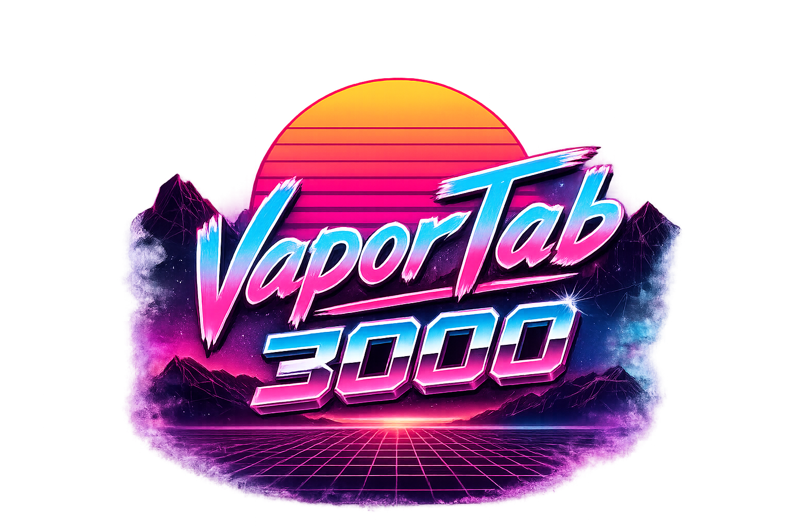
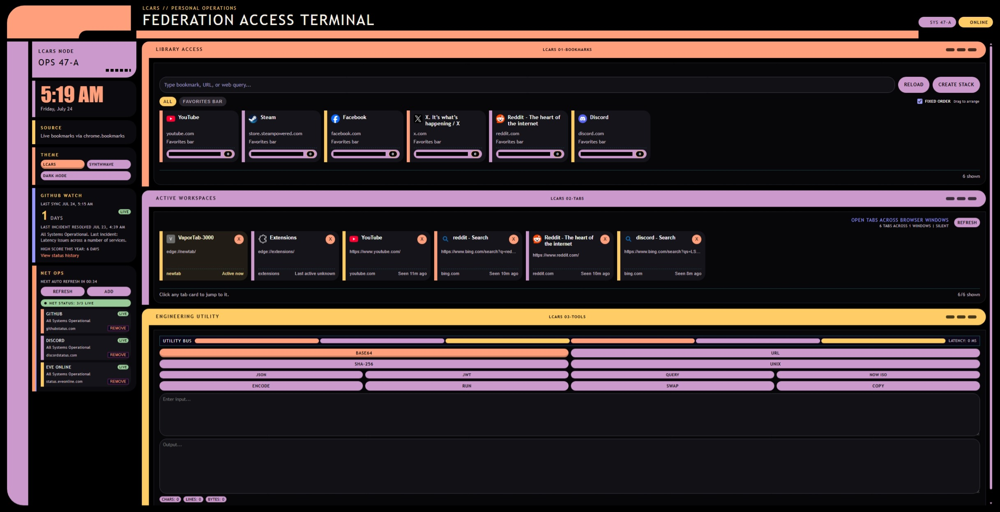
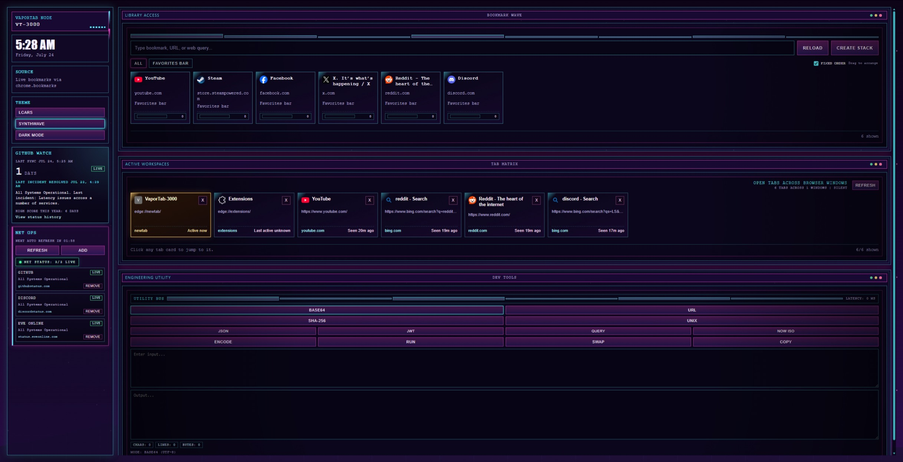
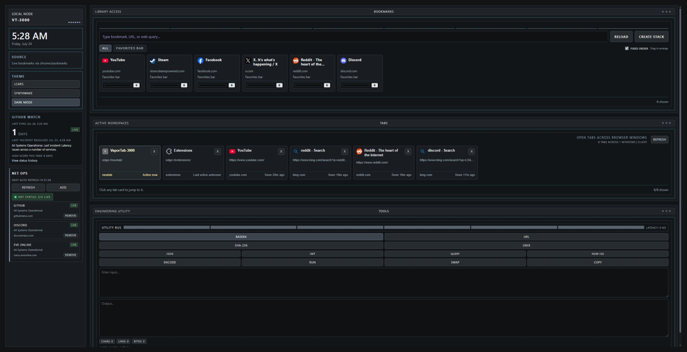

# VaporTab-3000

A custom Chromium new-tab page with a retro terminal look, live bookmarks, cross-window tab tools, status monitoring, and a small developer utility panel.

## What It Does

- Replaces the browser new-tab page through `chrome_url_overrides`
- Shows live browser bookmarks with folder filters and click heat/ranking
- Locks bookmark positions by default, with drag-and-drop custom ordering and an optional click-count sort
- Uses browser-provided icons first and Google favicon lookup as a fallback when the browser cache is unavailable
- Supports stacked bookmarks for launch groups
- Shows open tabs across browser windows and lets you jump to or close them
- Includes a GitHub incident/watch card plus a configurable status-source sidebar
- Includes a small utility panel for Base64, URL encode/decode, SHA-256, and Unix timestamp conversion
- Supports theme switching between `LCARS`, `Synthwave`, and `Dark Mode`

## Screenshots

### LCARS

### Synthwave

### Dark Mode

## Requirements

- A Chromium browser that supports Manifest V3 extensions
- Permissions used by this extension:
  - `bookmarks`
  - `tabs`
  - `favicon`
  - host access to `"<all_urls>"`

## Install / Load

There is no build step.

1. Open the browser extensions page.
2. Enable developer mode.
3. Choose `Load unpacked`.
4. Select the repository folder containing `manifest.json`.
5. Open a new tab.

Firefox, Chrome, Chromium, and Vivaldi all use the same [manifest.json](manifest.json) and [new-tab.html](new-tab.html). There are no browser-specific page copies.

## Stacked Bookmarks

Stacked bookmarks are represented by bookmark folders whose name starts with `[stack]`.

Example:

- `[stack] Morning Run`
- `[stack] Meme Time`

How it works:

- Click `Create Stack` beside the bookmark search field.
- Name the stack and search or browse all bookmarks in the left panel.
- Add at least two bookmarks to the right panel, then use the arrow controls to arrange their launch order.
- Click `Create Stack`. The final item in the right panel becomes the foreground destination.
- The page creates a `[stack]` folder beside the first selected bookmark and copies the selected bookmarks into it. Original bookmarks remain in place.

You can still build one manually by creating a bookmark folder whose name starts with `[stack]` and placing its bookmarks in launch order.

Launch behavior:

- Earlier items in the stack open as supporting tabs.
- The final item behaves like the primary destination.
- Existing-tab matching can still kick in for stack items, depending on what is already open.

## Existing Tab Matching

When a bookmark matches an already-open tab, the page can prompt you with a chooser modal.

Current behavior:

- For a normal bookmark, choosing an existing tab moves that tab into the current window beside the current new-tab page, then closes the current new-tab page.
- For stack launches, reused tabs are also moved into the current window so the stack stays local instead of scattering across windows.

## Project Layout

- [new-tab.html](new-tab.html): main markup
- [styles.css](styles.css): all styling and responsive layout
- [index.html](index.html): standalone privacy policy for GitHub Pages
- `icons/`: shared browser and store icons in 16, 32, 48, and 128 pixel sizes
- [js/app-core.js](js/app-core.js): shared state, DOM references, helpers, calculator, permissions, and browser API access
- [js/app-status.js](js/app-status.js): status feed logic, GitHub watch card, and bookmark match modal logic
- [js/app-tabs.js](js/app-tabs.js): tab rendering, focusing, closing, and move helpers
- [js/app-bookmarks.js](js/app-bookmarks.js): bookmark loading, filtering, stacked bookmark launch logic, and address handling
- [js/app-init.js](js/app-init.js): event listeners and bootstrapping

## Development Notes

- The app is plain HTML/CSS/JavaScript with no bundler.
- Script loading order matters because the files share global state/functions.
- If bookmark or tab behavior changes, reload the unpacked extension before testing again.

## Packaging

Run `task` or `task package` to build the browser packages. Use
`task package:force` when you want to rebuild them even when Task considers the
sources unchanged.

The task creates Chrome and Firefox ZIP files in `web-ext-artifacts/`. Packaging
uses an explicit runtime-file allowlist, so documentation, repository settings,
the privacy page, and existing build artifacts are not included.

When a GitHub Release is published, the `Build release packages` workflow checks
out that release tag, runs `task package:force`, and attaches both ZIP files to
the release automatically.

## Troubleshooting

### Bookmarks show fallback data

That usually means the page could not read browser bookmarks in the current context. Check that the extension is loaded correctly and still has `bookmarks` permission.

### Stack launches are behaving strangely

Open DevTools on the new-tab page and look for `stack-debug` console lines. The app logs stack launch state, reuse checks, tab creation, and tab move requests to help debug placement issues.

### Status sources are blank

The sidebar status cards rely on public status endpoints. Temporary fetch failures should show up in the UI as error states.

## Version

Current manifest version: `0.2.0`
